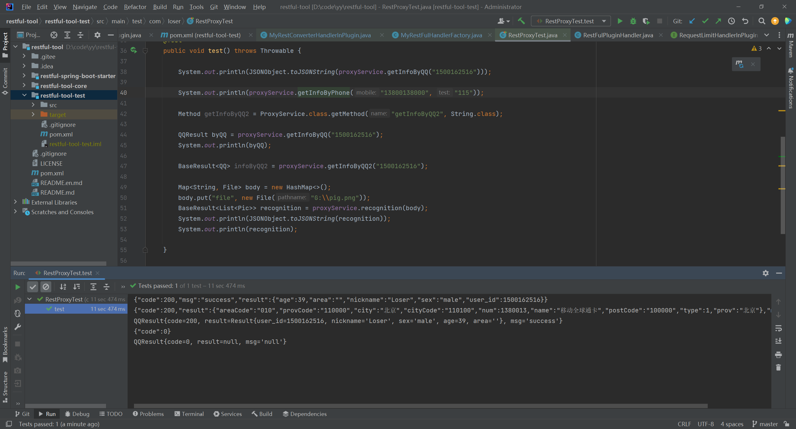

# restful-tool

#### 介绍

基于接口代理的restFul http接口调用

#### 软件架构

基于JDK动态代理开发的实现restFul的http工具包;
采用插件式开发、用户可随意替换部分或全部插件更符合不同项目使用

#### 效果展示



#### 使用说明

1. 添加依赖

```xml

<dependency>
    <groupId>io.github.loserya</groupId>
    <artifactId>restful-spring-boot-starter</artifactId>
    <version>1.0.0</version>
</dependency>
```

2. 启动类添加注解开启功能

```java
@EnableAnnoProxy(basePackages = {"com.loser"})
@EnableRestFulClient
```

3. 添加接口并标记相关注解实现代理

```java

@RestFulClient(host = "https://api.oioweb.cn", timeOut = 10000)
@RequestRetry(retryNum = 2, sleepTime = 50)
@RequestRollBack(rollBack = ProxyServiceRollBack.class)
public interface ProxyService {

    @GetMapping("/api/common/teladress/{test}")
    String getInfoByPhone(@RequestParam("mobile") String mobile, @PathVariable("test") String test);

    @GetMapping(value = "/api/qq/info", timeOut = 500, headers = {"anchor=loser"})
    QQResult getInfoByQQ(@RequestParam("qq") String qq);

    @PostMapping("/test/json")
    String getByJson(@RequestBody Map<String, Object> req);

    @PostMapping(value = "/api/ocr/recognition", timeOut = 60000, bodyType = ReqBodyType.FORM)
    PicResult checkPick(@RequestBody Map<String, File> req);

    @GetMapping(value = "/api/qq/info", timeOut = 500, headers = {"anchor=loser"})
    BaseResult<QQ> getInfoByQQ2(@RequestParam("qq") String qq);

    @PostMapping(value = "/api/ocr/recognition", timeOut = 10000, bodyType = ReqBodyType.FORM)
    BaseResult<List<Pic>> recognition(@RequestBody Map<String, File> body);

}
```

4. 项目核心注解

| 序号 | 注解                   | 功能         | 作用范围       |
|----|----------------------|------------|------------|
| 1  | @EnableAnnoProxy     | 开启接口代理     | 启动类、配置类    |
| 2  | @EnableRestFulClient | 总开关        | 启动类、配置类    |
| 3  | @PostMapping         | 发送post请求   | 接口方法       |
| 4  | @GetMapping          | 发送get请求    | 接口方法       |
| 5  | @PutMapping          | 发送put请求    | 接口方法       |
| 6  | @DeleteMapping       | 发送delete请求 | 接口方法       |
| 7  | @RequestBody         | 请求参数体      | 方法参数(引用类)  |
| 8  | @RequestParam        | url?携带参数   | 方法参数(基本类型) |
| 9  | @PathVariable        | url路径变量    | 方法参数(基本类型) |
| 10 | @RequestRollBack     | 请求降级       | 接口、接口方法    |
| 11 | @RequestRetry        | 请求重试       | 接口、接口方法    |
| 12 | @RequestLimit        | 请求限制       | 接口、接口方法    |

5. 项目核心类

```java
com.loser.core.support.base.BaseRestFulHandlerFactory

        集中管理所有功能插件的工厂生产者,需要替换全部插件实现改接口并注入容器可以实现全部插件替换

        注意点:
        单例且对象在容器中的名称必须为 restFulHandlerFactory
@Override
public void setApplicationContext(ApplicationContext applicationContext)throws BeansException{

        if(Objects.nonNull(baseRestFulHandlerFactory)){
        return;
        }
        if(applicationContext.containsBean(Constant.BEAN.FACTORY)){
        baseRestFulHandlerFactory=applicationContext.getBean(Constant.BEAN.FACTORY,BaseRestFulHandlerFactory.class);
        }else{
        baseRestFulHandlerFactory=new RestFulHandlerFactory();
        }

        }
```

6. 核心插件

| 序号 | 插件                                 | 返回值                 | 功能                           |
|----|------------------------------------|---------------------|------------------------------|
| 1  | RequestMethodBuildHandlerInPlugin  | ReqMethod           | 构建请求方式                       |
| 2  | RequestUrlBuildHandlerInPlugin     | RequestUrl          | 构建请求URL                      |
| 3  | RequestHeadBuildHandlerInPlugin    | ReqHead             | 构建请求头                        |
| 4  | RequestBodyBuildHandlerInPlugin    | ReqBody             | 构建请求体                        |
| 5  | RestFulHttpExecutorHandlerInPlugin | String              | 构建请求执行器                      |
| 6  | RestConverterHandlerInPlugin       | Object              | 返回值转换                        |
| 7  | RequestHeadHandlerInPlugin         | Map<String, String> | 请求头额外补充(sign、token等需要代码处理场景) |
| 8  | RequestTimeOutBuildHandlerInPlugin | TimeOut             | 构建请求超时参数                     |
| 9  | RequestRollBackHandlerInPlugin     | Object              | 构建请求异常降级处理                   |
| 10 | RequestRetryHandlerInPlugin        | Object              | 构建请求重试                       |
| 11 | RequestLimitHandlerInPlugin        | void                | 构建请求限制                       |

```java
注意点
        单例,容器内最多添加一个实现类，不添加则使用core包中提供的默认是实现
```

#### 参与贡献

1. Fork 本仓库
2. 新建 Feat_xxx 分支
3. 提交代码
4. 新建 Pull Request


